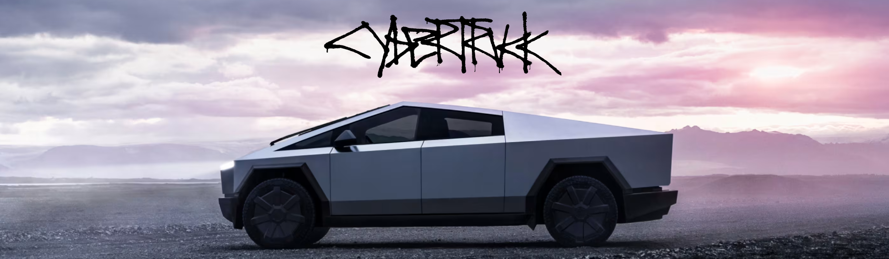

#   Clon Tesla with Astro 
 
<p align="center" style="color: white;">
    
</p>

```bash
git clone https://github.com/Juanes200122/Tesla_clon.git
```
<p>
    <a href="https://www.linkedin.com/in/juan-estaban-ar%C3%A9valo-056bab240/" target="_blank" rel="Linkedin">
      
    </a> 
    <a href="https://www.instagram.com/jeacsi.official_022?igsh=MWJ6MHRwcnhoZXVxbQ==" target="_blank" rel="Instagram">
      
    </a>
</p>


> 🧑‍🚀"**Experiencia Tesla:** Clon Interactivo y Responsivo con Astro y Tailwind"
> <p>Esta página cuenta con una barra de navegación con enlaces internos para moverse por las diferentes secciones. El diseño es responsivo y se ve excelente en dispositivos móviles. También incluye un desplazamiento vertical con animación obligatoria, mejorando la experiencia del usuario. 👀👉🏼https://tesla-with-astro.vercel.app/#Cybertruck</p>


## 🚀 Estructura de proyecto
Dentro de su proyecto Astro, verá las siguientes carpetas y archivos:

```text
/
├── public/
│   └── CAP
│   └── CyberTruck
├── src/
│   ├── components/
│   │   └── A1_LandingModel_S.astro
│   │   └── // // //.astro
│   ├── layouts/
│   │   └── Layout.astro
│   └── pages/
│       └── index.astro
└── package-lock.json
└── package.json
└── tailwind.config.mjs
└── tsconfig.json

```


## <b> Tecnologías Utilizadas</b>

- 🌐 &nbsp;
  
  
  
  
  
  


## 👀 Documentacion de Astro

No dudes en ponerte al dia en la [Documentación de Astro](https://docs.astro.build)
